# hypha

> A declarative user-environment and dotfiles configuration system


Hypha, is a declarative configuration system for managing a user's environment and dotfiles.
It represents configuration as Resources defined by declarative manifests, forming a
dependency graph that is reconciled through pluggable controllers.

```mermaid
flowchart LR
    subgraph MANIFESTS["Manifests"]
        MAN0["sym-0.yaml"]
        MAN1["sym-1.json"]
        MAN2["directories.jsonnet"]
        MAN3["packages.jsonnet"]
    end

    subgraph ORCHESTRATOR["Orchestrator"]
        subgraph CONTROLLERS["Controllers"]
            SYM_CONTROLLER["Symlink Controller"]
            DIR_CONTROLLER["Directory Controller"]
            PKG_CONTROLLER["Package Controller"]
        end

        subgraph RESOURCE_GRAPH["Resource Graph"]
            RES0["sym-0"]
            RES1["sym-1"]

            RES2["dir-0"]
            RES3["dir-1"]

            RES4["pkg-0"]
            RES5["pkg-1"]
            RES6["pkg-2"]
        end
    end

    MAN0 & MAN1 --> SYM_CONTROLLER
    MAN2 --> DIR_CONTROLLER
    MAN3 --> PKG_CONTROLLER
    SYM_CONTROLLER --> RES0 & RES1
    DIR_CONTROLLER --> RES2 & RES3
    PKG_CONTROLLER --> RES4 & RES5 & RES6

    RES0 --- SYM0
    RES1 --- SYM1

    RES2 --- DIR0
    RES3 --- DIR1

    RES4 --- PKG0
    RES5 --- PKG1
    RES6 --- PKG2
    subgraph SYSTEM["System Resources"]
        SYM0[".gitconfig => ~/.gitconfig"]
        SYM1[".zshrc => ~/.zshrc"]

        DIR0["~/Photos"]
        DIR1["~/Documents"]

        PKG0["git"]
        PKG1["neovim"]
        PKG2["zoxide"]
    end

    classDef pkg fill:#000,stroke:#333,stroke-width:2px;
    classDef dir fill:#bbf,stroke:#000,color:#000,stroke-width:2px;
    classDef sym fill:#bfb,stroke:#333,color:#000,stroke-width:2px;
    class PKG0,PKG1,PKG2,RES4,RES5,RES6,MAN3,PKG_CONTROLLER pkg;
    class DIR0,DIR1,RES2,RES3,MAN2,DIR_CONTROLLER dir;
    class SYM0,SYM1,RES0,RES1,MAN0,MAN1,SYM_CONTROLLER sym;
```



## Features

- Fully self-contained static binary
- Define dotfiles and configurations using Jsonnet, YAML or JSON
- Scriptable engine to programmatically discover, filter or procedurally generate manifests and react to orchestration events.
- Interactive and pipe-able TUI
- Read-only local web dashboard for inspecting the resource graph

## Installation

Hypha is distributed as a single static binary.
You can download from the [Releases](https://github.com/arcadia-de/hypha/releases) page, or by using one of the tools below:

```sh
# using curl:
curl -L https://github.com/arcadia-de/hypha/releases/latest/download/hypha -o hypha
# using wget:
wget https://github.com/arcadia-de/hypha/releases/latest/download/hypha
# using httpie:
https --download https://github.com/arcadia-de/hypha/releases/latest/download/hypha
```

Once you have downloaded, you will most likely need to set it to executable:

```sh
chmod +x ./hypha
```

Then move it to your system path:

```sh
sudo mv ./hypha /usr/local/bin/hypha
```

## Quick Start

### Declare Some Resources

> Hypha allows you to define manifests using Jsonnet, JSON, & YAML

```jsonnet
// ~/.config/hypha/example.jsonnet:
local hypha = import 'lib/hypha.libsonnet';
[
  // Create a symlink .gitconfig => ~/.gitconfig
  hypha.SymlinkManifest('gitconfig', spec={
    source: ".gitconfig",
    target: "~/.gitconfig",
  }),
]
```

> Create another manifest, this time using YAML.

```yaml
# ~/.config/hypha/git.yaml:
---
kind: Package
metadata:
  name: git
  labels:
    - test
spec:
  target: git
```

### Script the Manifest Discovery Process

> By default, Hypha can discover manifests automatically.
> 
> Any file found in the config directory `~/.config/hypha` with one of the following extensions is considered a valid manifest source:
>
> - .jsonnet
> - .yaml
> - .json
>
>
> However, you can also provide an `init.lua` in the config directory to customize how and what manifests get loaded:

```lua
--- ~/.config/hypha/init.lua:
local sources = require('hypha.sources')
return {
  -- load the new manifests from ~/.config/hypha/example.jsonnet
  sources.file("%h/example.jsonnet"),
  sources.file("%h/git.yaml"),
  -- manifests can also be provided directly from lua
  -- create the directory:  ~/.config/hypha/test-dir
  sources.raw([[
  {
    kind: "Directory",
    metadata: {
      "name": "TestDirectory",
      "labels": [
        "test",
      ],
    },
    spec: {
      "target": "%h/test-dir",
    },
  }
  ]])
}
```

### Plan & Apply Your Changes

Once your config is defined, you can preview the changes Hypha would make with `plan`:

> Optional, but highly recommended

```sh
hypha plan
```

Finally, if your changes look correct, let's apply those changes:

```sh
hypha apply
```


### Observe Your Resources

Once your resources are managed by Hypha, you can inspect them using:

| Command                                                                      | Description                                                       |                  Example                 |
|:-----------------------------------------------------------------------------|:------------------------------------------------------------------|:----------------------------------------:|
| `hypha list`<br/>`hypha ls`                                                  | List resources, show a vertical slice of the resource graph       |          |
| `hypha describe`<br/>`hypha desc`                                            | Describe resources, show a horizontal slice of the resource graph |  |
| `hypha query`<br/>`hypha query --expr 'resources(kind: "Controller"){ id }'` | Query the resource graph, filter and pick by the data you want    |                    TBD                   |
| `hypha browse`<br/>`hypha browse --web`                                      | Browse the resource graph using a TUI or web browser              |      |

> You can find more in the [Getting Started](https://github.com/arcadia-de/hypha/wiki/Getting-Started) page in the wiki.

## Building From Source

Check out the [build docs](https://github.com/arcadia-de/hypha/wiki/Building) and [developer guide](https://github.com/arcadia-de/hypha/wiki/DeveloperGuide) in the wiki.

## Running the Sandbox

You can run Hypha in a sandbox to try it out if you'd like:

```sh
docker run                                          \
  -it                                               \
  --rm                                              \
  --name hypha-sandbox                              \
  -v /path/to/your/local/config:/root/.config/hypha \
  ghcr.io/arcadia-de/hypha/sandbox:latest
```

> More information available in the [developer guide](https://github.com/arcadia-de/hypha/wiki/DeveloperGuide).

## Wiki

Check out the [wiki](https://github.com/arcadia-de/hypha/wiki) for more information.

## Status

This project is currently experimental and not every planned feature is working.

|      OS | Description                                                                                                                    |
|--------:|:-------------------------------------------------------------------------------------------------------------------------------|
|   Linux | So far the most active development for this project has been on [Arch](https://archlinux.org/) & [Ubuntu](https://ubuntu.com/) |
|   macOS | I have plans to support OSX, TBD still                                                                                         |
| Windows | Windows support is a long way away                                                                                             |

> If your OS doesn't work:
>
> - Submit a Pull Request (PR)
> - Submit an Issue

## Contributing

See the [Contributing guide](https://github.com/arcadia-de/hypha/wiki/Contributing) in the wiki for contribution guidelines and development information.

### AI Contributions

AI-assisted and AI-generated contributions **are welcome**.
However, AI contributions are subject to additional disclosure and review requirements described in the
[AI Contributions](https://github.com/arcadia-de/hypha/wiki/Contributing#AI) section of the Contributing guide.

## AI Usage Disclaimer

This project contains some contributions made using AI.
These contributions undergo additional review before merging.

For transparency, known AI usage in this project is documented below:

- [Claude](https://claude.ai) --- Free tier, Sonnet 5 Medium
  - Refactoring the `Resource` ID field from `char*` to `uuid_t`
  - Adding telemetry tracking and reporting data to resources
  - Additional contributions can be found in [Claude's commits](https://github.com/arcadia-de/hypha/commits?author=claude)

AI usage does not imply that the resulting changes were accepted without review.
AI-generated changes remain subject to the project's normal architectural, design, correctness, testing,
and maintainability standards, in addition to the requirements described in the AI Contributions section.

## Credits

Hypha is inspired by the [helm](https://helm.sh/), [dotbot](https://github.com/anishathalye/dotbot), and [home-manager](https://github.com/nix-community/home-manager)

With contributions by the following:

- [ChatGPT](https://chatgpt.com/) --- Logo
- [Claude](https://claude.ai/) --- Some [contributions](https://github.com/arcadia-de/hypha/commits?author=claude)

## License

See [LICENSE](/LICENSE).
