# hypha

> A declarative user-environment and dotfiles configuration system


Hypha, is a declarative configuration system for managing a user's environment and dotfiles.
It represents configuration as Resources defined by declarative manifests, forming a
dependency graph that is reconciled through pluggable controllers.

```mermaid
flowchart LR
    subgraph MANIFESTS["Manifests"]
        MAN0["sym-0.yaml"]
        MAN1["sym-1.json"]
        MAN2["directories.jsonnet"]
        MAN3["packages.jsonnet"]
    end

    subgraph ORCHESTRATOR["Orchestrator"]
        subgraph CONTROLLERS["Controllers"]
            SYM_CONTROLLER["Symlink Controller"]
            DIR_CONTROLLER["Directory Controller"]
            PKG_CONTROLLER["Package Controller"]
        end

        subgraph RESOURCE_GRAPH["Resource Graph"]
            RES0["sym-0"]
            RES1["sym-1"]

            RES2["dir-0"]
            RES3["dir-1"]

            RES4["pkg-0"]
            RES5["pkg-1"]
            RES6["pkg-2"]
        end
    end

    MAN0 & MAN1 --> SYM_CONTROLLER
    MAN2 --> DIR_CONTROLLER
    MAN3 --> PKG_CONTROLLER
    SYM_CONTROLLER --> RES0 & RES1
    DIR_CONTROLLER --> RES2 & RES3
    PKG_CONTROLLER --> RES4 & RES5 & RES6

    RES0 --- SYM0
    RES1 --- SYM1

    RES2 --- DIR0
    RES3 --- DIR1

    RES4 --- PKG0
    RES5 --- PKG1
    RES6 --- PKG2
    subgraph SYSTEM["System Resources"]
        SYM0["sym-0<br/>.gitconfig => ~/.gitconfig"]
        SYM1["sym-1<br/>.zshrc => ~/.zshrc"]

        DIR0["~/Photos"]
        DIR1["~/Documents"]

        PKG0["git"]
        PKG1["neovim"]
        PKG2["zoxide"]
    end

    classDef pkg fill:#000,stroke:#333,stroke-width:2px;
    classDef dir fill:#bbf,stroke:#000,color:#000,stroke-width:2px;
    classDef sym fill:#bfb,stroke:#333,color:#000,stroke-width:2px;
    class PKG0,PKG1,PKG2,RES4,RES5,RES6,MAN3,PKG_CONTROLLER pkg;
    class DIR0,DIR1,RES2,RES3,MAN2,DIR_CONTROLLER dir;
    class SYM0,SYM1,RES0,RES1,MAN0,MAN1,SYM_CONTROLLER sym;
```



## Example

First let's define some manifests

> Hypha allows you to define manifests using Jsonnet, JSON, & YAML

```jsonnet
// ~/.config/hypha/example.jsonnet:
local hypha = import 'lib/hypha.libsonnet';
[
  // Create a symlink .gitconfig => ~/.gitconfig
  hypha.SymlinkManifest('gitconfig', spec={
    source: ".gitconfig",
    target: "~/.gitconfig",
  }),
]
```

> Create another manifest, this time using YAML.

```yaml
# ~/.config/hypha/git.yaml:
---
kind: Package
metadata:
  name: git
  labels:
    - test
spec:
  target: git
```

> By default, Hypha can discover manifests automatically.
> 
> Any file found in the config directory `~/.config/hypha` with one of the following extensions is considered a valid manifest source:
>
> - .jsonnet
> - .yaml
> - .json
>
>
> However, you can also provide an `init.lua` in the config directory to customize how and what manifests get loaded:

```lua
--- ~/.config/hypha/init.lua:
local sources = require('hypha.sources')
return {
  -- load the new manifests from ~/.config/hypha/example.jsonnet
  sources.file("%h/example.jsonnet"),
  sources.file("%h/git.yaml"),
  -- manifests can also be provided directly from lua
  -- create the directory:  ~/.config/hypha/test-dir
  sources.raw([[
  {
    kind: "Directory",
    metadata: {
      "name": "TestDirectory",
      "labels": [
        "test",
      ],
    },
    spec: {
      "target": "%h/test-dir",
    },
  }
  ]])
}
```

Once your config is defined, you can preview the changes Hypha would make with `plan`:

> Optional, but highly recommended

```sh
hypha plan
```

Finally, if your changes look correct, let's apply those changes:

```sh
hypha apply
```


> You can find more in the [Getting Started](https://github.com/arcadia-de/hypha/wiki/Getting-Started) page in the wiki.

Now that you have created some resources....

You can `list` them:


You can `describe` them:


Or `browse` them:


> You can also use --web with the `browse` command to open a read-only web dashboard to visualize the resource graph
>
> By default, the `browse` command just opens a TUI for visualizing the resource graph

## Building From Source

Check out the [build docs](https://github.com/arcadia-de/hypha/wiki/Building) and [developer guide](https://github.com/arcadia-de/hypha/wiki/DeveloperGuide) in the wiki.

## Running Using the Sandbox

## Wiki

Check out the [wiki](https://github.com/arcadia-de/hypha/wiki) for more information.

## CLI

> A preview of the sub-commands for Hypha, you can find out more in the wiki

```sh
hypha --help
```

```text
A dotfile manager

Usage:
  hypha [command]

Configuration Commands
  adopt       Adopt specific resources into the resource graph
  apply       Apply your configuration
  gc          Cleanup orphaned resources
  generate    generate a manifest for a given resource
  init        Initialize hypha on a system
  plan        Preview the pending changes
  status      Show resource drift
  tidy        Cleanup the configuration dir

Inspection Commands
  browse      Open a read-only interactive browser session
  describe    Describe a resource
  explain     Explain why a resource exists
  graph       Graph the resources
  history     Show the history of the resource graph
  lint        Lint the specified manifests
  list        List resources in the graph
  query       Query the resource graph using an expression
  validate    Validate the specified manifests

Development Commands
  docs        Open the documentation for a specific resource kind in the system browser
  eval        Evaluate a lua expression or file
  lsp         Run the LSP service for a manifest

Resource Commands

Additional Commands:
  completion  Generate the autocompletion script for the specified shell
  help        Help about any command
  info        Show runtime info
  rocks       Manipulate luarocks packages

Flags:
      --cache-dir string    The cache dir for hypha (default "/home/tazz/.cache/hypha")
      --config-dir string   The configuration dir for hypha (default "/home/tazz/.config/hypha")
  -h, --help                help for hypha
      --state-dir string    The state dir for hypha (default "/home/tazz/.local/state/hypha")
  -v, --verbose             add more detailed output

Use "hypha [command] --help" for more information about a command.
```

## Status

This project is currently experimental and not every planned feature is working.

|      OS | Description                                                                                                                    |
|--------:|:-------------------------------------------------------------------------------------------------------------------------------|
|   Linux | So far the most active development for this project has been on [Arch](https://archlinux.org/) & [Ubuntu](https://ubuntu.com/) |
|     OSX | I have plans to support OSX, TBD still                                                                                         |
| Windows | Windows support is a long way away                                                                                             |

> If your OS doesn't work:
>
> - Submit a Pull Request (PR)
> - Submit an Issue

## Contributing

See the [Contributing guide](https://github.com/arcadia-de/hypha/wiki/Contributing) in the wiki for contribution guidelines and development information.

### AI Contributions

AI-assisted and AI-generated contributions **are welcome**.
However, AI contributions are subject to additional disclosure and review requirements described in the
[AI Contributions](https://github.com/arcadia-de/hypha/wiki/Contributing#AI) section of the Contributing guide.

## AI Usage Disclaimer

This project contains some contributions made using AI.
These contributions undergo additional review before merging.

For transparency, known AI usage in this project is documented below:

- [Claude](https://claude.ai) --- Free tier, Sonnet 5 Medium
  - Refactoring the `Resource` ID field from `char*` to `uuid_t`
  - Adding telemetry tracking and reporting data to resources
  - Additional contributions can be found in [Claude's commits](https://github.com/arcadia-de/hypha/commits?author=claude)

AI usage does not imply that the resulting changes were accepted without review.
AI-generated changes remain subject to the project's normal architectural, design, correctness, testing,
and maintainability standards, in addition to the requirements described in the AI Contributions section.

## Credits

Hypha is inspired by the [helm](https://helm.sh/), [dotbot](https://github.com/anishathalye/dotbot), and [home-manager](https://github.com/nix-community/home-manager)

With contributions by the following:

- [ChatGPT](https://chatgpt.com/) --- Logo
- [Claude](https://claude.ai/) --- Some [contributions](https://github.com/arcadia-de/hypha/commits?author=claude)

## License

See [LICENSE](/LICENSE).
